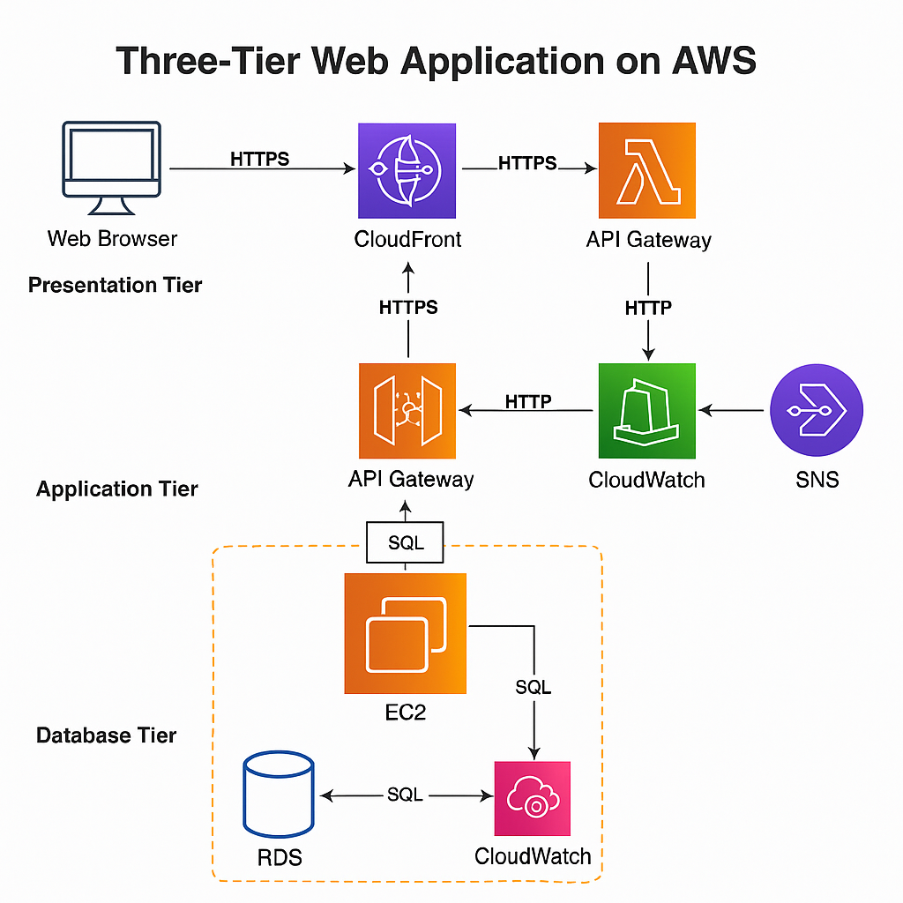

# 🚀 Three-Tier Architecture with Auto Scaling (AWS)

A fully production-grade web application deployed on AWS using a **Three-Tier Architecture** with CI/CD and autoscaling. Built with:

- 🖥️ Frontend: HTML + Bootstrap (served via CloudFront & S3)
- 🧠 Backend: Node.js on EC2 (behind ALB + Auto Scaling)
- 💾 Database: Amazon RDS (MySQL)
- ☁️ Deployment: GitHub Actions + Terraform + CloudWatch

---

## 📐 Architecture



---

## 🔧 Tech Stack

| Layer       | Services Used                                                                 |
|-------------|--------------------------------------------------------------------------------|
| Frontend    | Amazon S3, CloudFront, Bootstrap UI                                            |
| Backend     | EC2, Auto Scaling Group, Application Load Balancer (ALB), Node.js Express App |
| Database    | Amazon RDS (MySQL)                                                             |
| Monitoring  | Amazon CloudWatch Alarms + SNS Notifications                                   |
| CI/CD       | GitHub Actions, IAM OIDC Role for deployment                                   |
| IaC         | Terraform (Optional for provisioning all resources)                            |

---

## 💡 Features

- 🔁 **Auto Scaling** based on CPU utilization
- 🔐 **Private RDS** instance in secure subnets
- 📦 **RESTful API** for users & products
- 📈 **CloudWatch Alarms** for monitoring with SNS alerts
- 🚀 **CI/CD** via GitHub Actions using OIDC for secure deployments
- 🌐 **CORS-enabled HTTP API Gateway** to bridge frontend and backend

---

## 📁 Project Structure

```bash
├── backend/
│   ├── index.js          # Express API for Users & Products
│   └── package.json
├── frontend/
│   └── index.html        # Bootstrap UI for interacting with backend
├── .github/
│   └── workflows/
│       └── deploy.yml    # GitHub Actions CI/CD for backend
├── terraform/            # Optional Terraform IaC scripts
├── architecture.png      # Architecture diagram
└── README.md


🚀 Deployment Steps
✅ 1. Launch Infrastructure
Provision VPC, subnets, ALB, EC2, and RDS manually or via Terraform.

✅ Ensure EC2 instances have IAM role to access CloudWatch & required services.

✅ 2. Configure Backend
SSH into EC2 instance

Clone the repo

Install dependencies: npm install

Start app: node index.js or use pm2

✅ 3. Configure RDS
Create MySQL DB in private subnet

Connect from EC2 and run schema scripts

Store DB credentials in environment variables

✅ 4. Upload Frontend to S3
Upload index.html to public S3 bucket

Set up CloudFront to serve it securely

✅ 5. Set Up API Gateway
Create HTTP API

Integrate with ALB using VPC Link

Enable CORS for S3 origin

✅ 6. Enable CI/CD via GitHub Actions
Create OIDC IAM Role in AWS

Add role ARN & region in GitHub repo secrets

Push to main → triggers deployment to Lambda or EC2

📬 CloudWatch Alarms & Alerts
CPU > 70% → scale out

CPU < 30% → scale in

Alarms notify via Amazon SNS

SNS can send email alerts to admins/devs

🔒 Security
IAM roles with least privilege

RDS in private subnet, no public access

ALB uses security groups

CORS policies in API Gateway to prevent unauthorized access

🧪 API Endpoints
Method	Endpoint	Description
POST	/api/users	Create new user
GET	/api/users	List all users
POST	/api/products	Create new product
GET	/api/products	List all products
